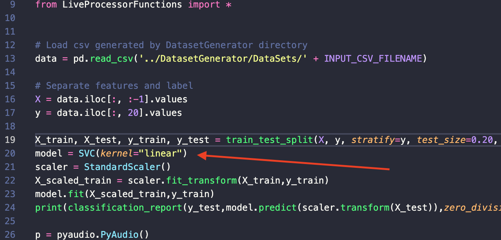
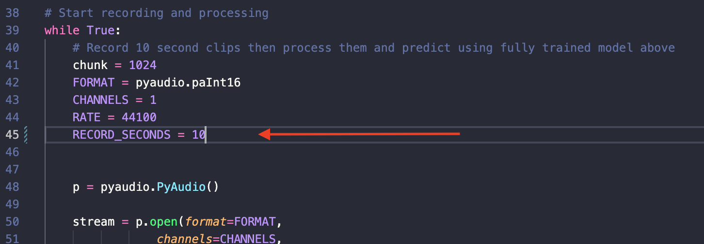

# Dissertation - Predicting Key Presses Using Machine Learning

This is the project repo for psyam22 dissertation - Predicting Key Presses over Video Calls using an Audio Side-Channel Attack and Machine Learning.

This repo contains the following
* Key-Logger Program to collect keypresses and timestamps as well as a local audio recording
* Various Audio Splitter Programs to split Microsoft Teams Audio into isolated files
* Live Processor Program to make predictions on redirected live audio

## Prerequisites
### Python
This project was built for Python 3.9.6 so that is the recommended and only supported version.
### BlackHole Virtual Audio Driver
In order for the Live Processor to work audio will need to be redirected from Microsoft Teams into a virtual audio location. Note this project was created for a mac so another unsupported may need to be found if you are using anything other than this.

To install BlackHole go to their [github](https://github.com/ExistentialAudio/BlackHole) and follow the relevant instructions. When installed, in order to pipe audio from Microsoft Teams to it, open the settings in the Microsoft Teams app, head over to the Settings menu, and then into the Devices submenu. Once here, simply change the speaker drop down to BlackHole and it should now be sending audio to their when in your next meeting.

## Audio Splitter User Guide
- Navigate to the DatasetGenerator directory via `cd DatasetGenerator`
- `pip install` the required packages for the audio splitter you want to run
- Clone the `configExample.py` and rename to `config.py` then replace these placeholder values with real values
- Then run `python3 AUDIOSPLITTERFILENAME.py` to split up the input file into isolated files which will be distributed in the SplitAudioFiles directory
- To further create a dataset run `python3 featureExtractor.py` to take all files in the SplitAudioFiles directory and convert them into a dataset which is named via the config file

## Live Processor User Guide
- Navigate to the LiveProcessor directory via `cd LiveProcessor`
- Install packages required for the LiveProcessor and LiveProcessorFunctions files via `pip install packagename`
- Alter config file to values that you would like to run with:
    * INPUT_CSV_FILENAME - dataset to train processor model off
    * PREDICTION_SESSION_NAME - name of file to write predictions too, note this file needs to exist already otherwise an error will be thrown
- Once values have been configured run `python3 LiveProcessor.py` to start making predictions

## FAQ and Other Things
This project was only built for research purposes and although in its current state it is still not very accurate it should by no means be used in an actual attack.

### Changing the Model for the Live Processor
The Live Processor model can be changed very easily by simply changing the model at the top of the LiveProcessor.py file.

### Changing the Length of Recorded Audio Per Loop
Again similar to the above FAQ answer this can be changed easily by going into the LiveProcessor.py file and changing `RECORD_SECONDS` constant. Note this value is in seconds so an example value of 2 would be 2 seconds of recording before the audio was processed.

