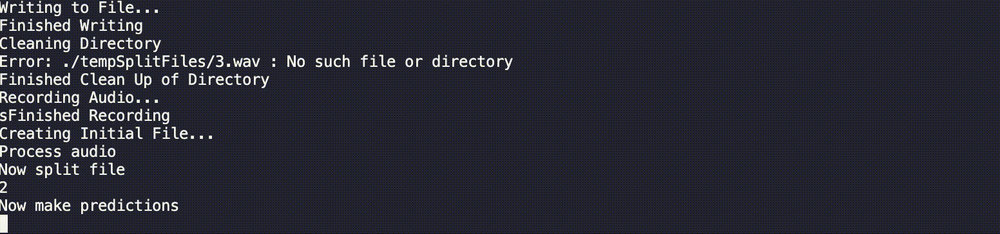

# Dissertation - Predicting Key Presses Using Machine Learning

This is the project repo for psyam22 dissertation - Predicting Key Presses over Video Calls using an Audio Side-Channel Attack and Machine Learning.

This repo contains the following
* Key-Logger Program to collect keypresses and timestamps as well as a local audio recording
* Various Audio Splitter Programs to split Microsoft Teams Audio into isolated files
* Live Processor Program to make predictions on redirected live audio

## Audio Splitter User Guide
- Navigate to the DatasetGenerator directory via `cd DatasetGenerator`
- `pip install` the required packages for the audio splitter you want to run
- Clone the `configExample.py` and rename to `config.py` then replace these placeholder values with real values
- Then run `python3 AUDIOSPLITTERFILENAME.py` to split up the input file into isolated files which will be distributed in the SplitAudioFiles directory
- To further create a dataset run `python3 featureExtractor.py` to take all files in the SplitAudioFiles directory and convert them into a dataset

